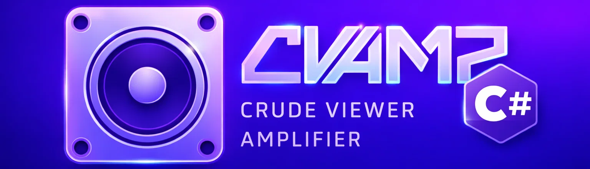
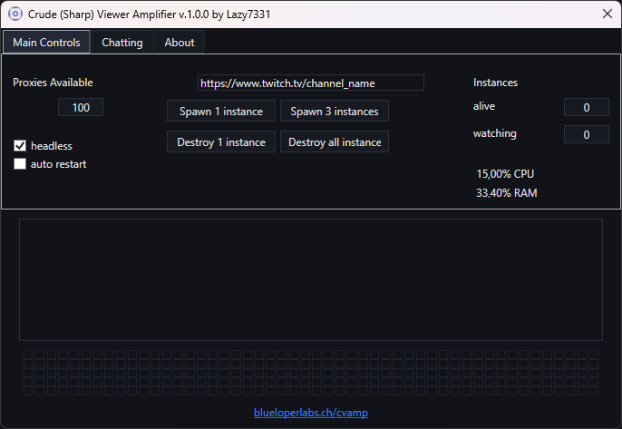

# CSharp-VAmp (C# / .NET WPF rewrite)

[](https://github.com/L4ZY7331/CSharp-VAmp/releases/latest)
[](https://github.com/L4ZY7331/CSharp-VAmp/actions/workflows/build_release_draft.yml)
[](https://github.com/L4ZY7331/CSharp-VAmp/actions/workflows/build.yml)



**Based on the open-source project** [KevinBytesTheDust/CVAmp](https://github.com/KevinBytesTheDust/CVAmp).  
This rewrite **does not include any premium/pro features** (no login, no automatic chat, no automatic follow).  
**Tested only on Twitch** so far. **Collaborators are appreciated.**

> Disclaimer: For educational purpose only. Any discussion of illegal use will be deleted immediately!  
> Full disclaimer below.

## Getting Started

- **Download** the latest Windows build from [Releases](https://github.com/L4ZY7331/CSharp-VAmp/releases/latest)
- **Add your proxies** to `proxy/proxy_list.txt`
- **Make sure Chrome is installed**

## What this version offers (C#)

- **Modern Windows UI**: WPF GUI with MVVM (clean separation and responsiveness)
- **.NET 8 / async architecture**: async/await throughout, background spawning/deleting
- **Playwright for .NET**: browser automation via `Microsoft.Playwright`
- **Instance management**: spawn/destroy multiple instances, status boxes, live log view
- **Monitoring**: CPU/RAM status shown in the UI
- **Config-driven**: tweak behavior via `appsettings.json` (headless, auto-restart, intervals, window size, threads)

## Mandatory Requirements

- **Windows 10/11** (WPF)
- **Google Chrome installed**
- **Private HTTP proxies** in `proxy/proxy_list.txt`

Proxy format:
```
ip:port
```
or
```
ip:port:username:password
```

## Install / Build from Source

1. Install **.NET 8 SDK** from [dotnet.microsoft.com](https://dotnet.microsoft.com/download)
2. Build:
```bash
dotnet build
```
3. Install Playwright browser (Chromium):
```bash
pwsh bin/Debug/net8.0-windows/playwright.ps1 install chromium
```
4. Run:
```bash
dotnet run
```

## In Action



## Controls and Color codes of the square boxes

⬛ - Instance is spawned/starting. 🟨 - Instance is buffering. 🟩 - Instance is actively watching.

🖱️ Left click: Refresh page  
🖱️ Right click: Destroy instance  
🖱️ Left click + CTRL: Take screenshot

## Configuration

Edit `appsettings.json`:

- **`SpawnThreadCount`**: number of spawn threads
- **`DeleteThreadCount`**: number of delete threads
- **`Headless`**: run browsers headless
- **`AutoRestart`**: restart instances automatically
- **`SpawnIntervalSeconds`**: delay between spawning instances
- **`WindowWidth` / `WindowHeight`**: browser window size
- **`RestartIntervalSeconds`**: auto-restart interval

## Platform Support Overview (this fork)

This fork is currently **tested only on Twitch**.

| Platform              | Twitch | Kick | YouTube | Chzzk |
| --------------------- | :---: | :--: | :-----: | :---: |
| General Functionality |  ⚠️   |  ?   |   ?     |   ?   |
| Login/Authentication  |  ❌   |  ❌  |   ❌     |  ❌   |
| Automatic Chat        |  ❌   |  ❌  |   ❌     |  ❌   |
| Automatic Follow      |  ❌   |  ❌  |   ❌     |  ❌   |

⚠️ = limited testing, ? = not tested yet

## Contributing

PRs and collaborators are welcome. If you want to help:
- Improve Twitch stability
- Add/verify other platforms (Kick/YouTube/Chzzk)
- Improve packaging/release UX

## Full disclaimer

This project was established to contribute to open-source collaboration and showcase the educational value of reverse engineering. Although its primary purpose is for learning and understanding, users must be aware that altering viewer metrics on platforms such as Twitch violates their Terms of Service and could lead to legal repercussions. We urge users to engage with this tool responsibly. Misuse is solely at your discretion and risk. Discussions promoting illegal activities will be promptly removed.

